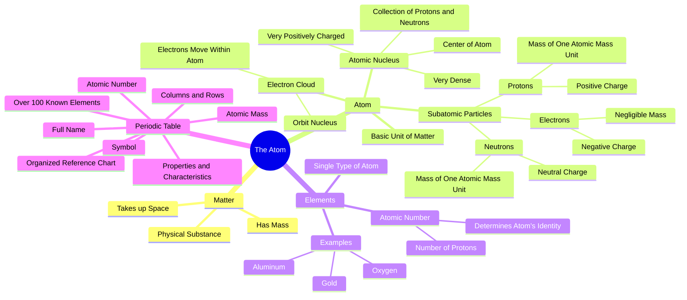

## Atoms Mindmap

```mermaid
mindmap
  root((The Atom))
    Matter
      Physical Substance
      Takes up Space
      Has Mass
    Atom
      Basic Unit of Matter
      Subatomic Particles
        Protons
          Positive Charge
          Mass of One Atomic Mass Unit
        Neutrons
          Neutral Charge
          Mass of One Atomic Mass Unit
        Electrons
          Negative Charge
          Negligible Mass
      Atomic Nucleus
        Collection of Protons and Neutrons
        Center of Atom
        Very Dense
        Very Positively Charged
      Electron Cloud
        Electrons Move Within Atom
        Orbit Nucleus
    Elements
      Single Type of Atom
      Examples
        Oxygen
        Aluminum
        Gold
      Atomic Number
        Number of Protons
        Determines Atom's Identity
    Periodic Table
      Organized Reference Chart
      Over 100 Known Elements
      Properties and Characteristics
      Full Name
      Symbol
      Atomic Number
      Atomic Mass
      Columns and Rows

```