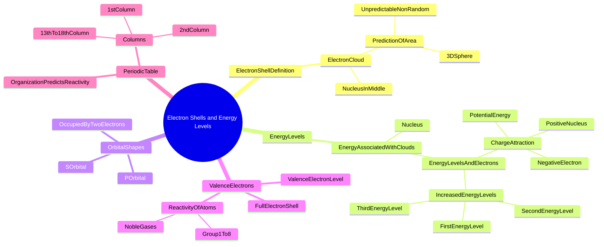

## Electron Shell and Energy Levels

```mermaid
mindmap
  root((Electron Shells and Energy Levels))
    ElectronShellDefinition
      ElectronCloud
        NucleusInMiddle
        PredictionOfArea
          3DSphere
          UnpredictableNonRandom
    EnergyLevels
      EnergyAssociatedWithClouds
        Nucleus
        EnergyLevelsAndElectrons
          ChargeAttraction
            NegativeElectron
            PositiveNucleus
            PotentialEnergy
          IncreasedEnergyLevels
            FirstEnergyLevel
            SecondEnergyLevel
            ThirdEnergyLevel
    OrbitalShapes
      SOrbital
      POrbital
      OccupiedByTwoElectrons
    ValenceElectrons
      ValenceElectronLevel
      FullElectronShell
      ReactivityOfAtoms
        Group1To8
        NobleGases
    PeriodicTable
      OrganizationPredictsReactivity
      Columns
        1stColumn
        2ndColumn
        13thTo18thColumn

```
