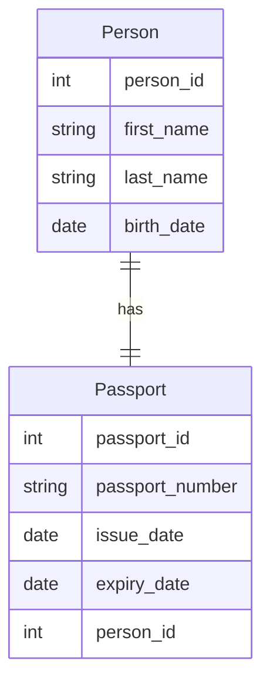
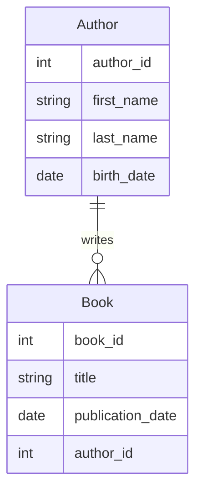
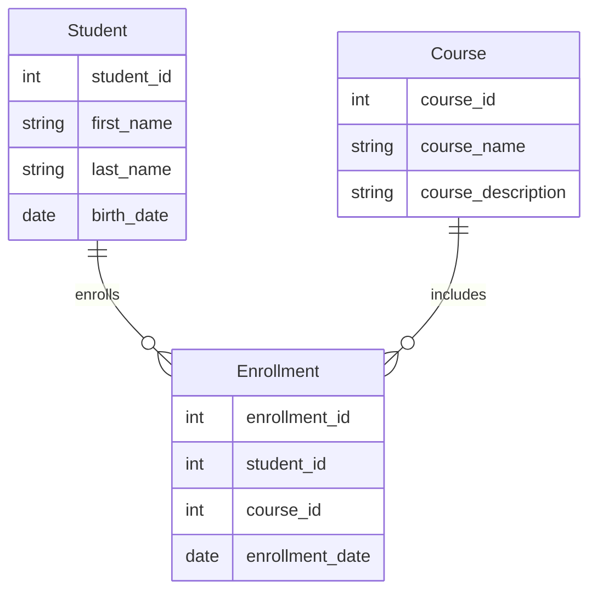
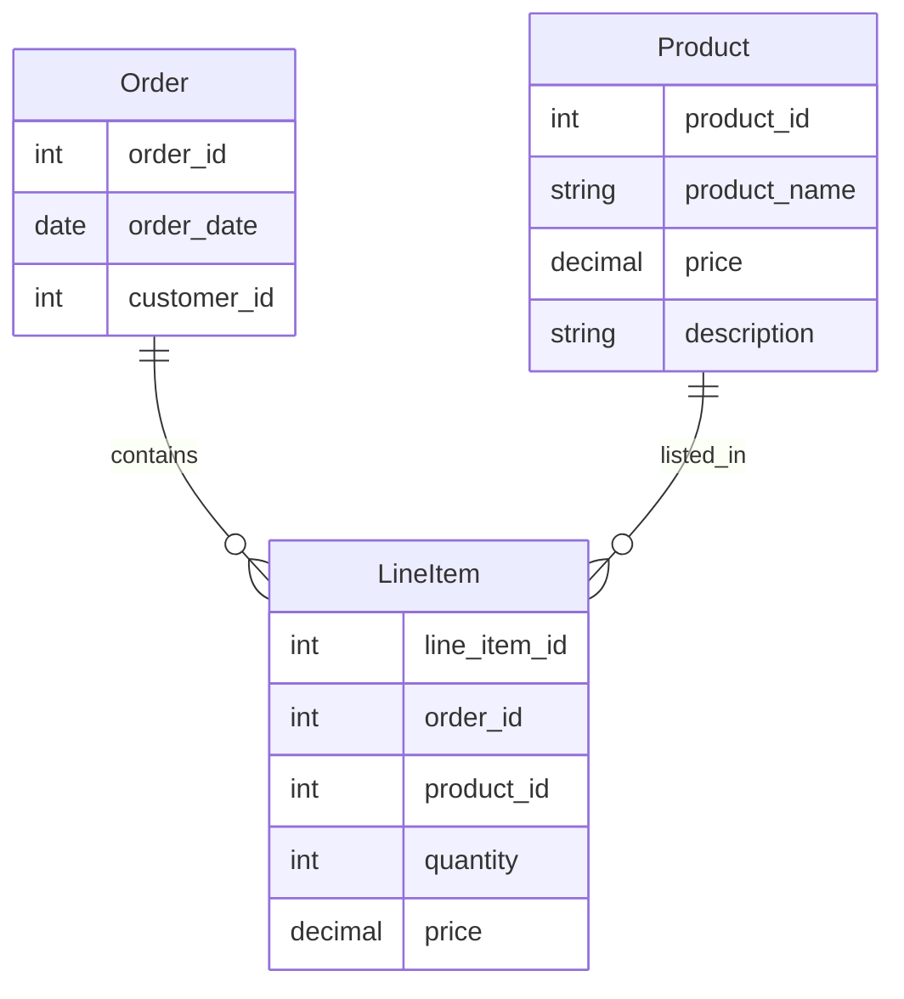
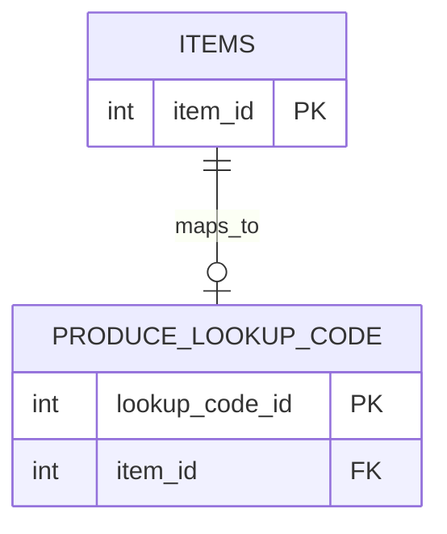

## ERD-101

Entity Relationship Diagrams

### 1:1 Mapping

This diagram represents that each **Person** has one **Passport** and each **Passport** is assigned to one Person.

* * *

### 1:M (1 to Many) relationship

In this diagram, each Author can write many Books, but each Book is written by only one Author.

### M:M (Many to Many) relationship

In this diagram, each Student can enroll in many **Courses**, and each **Course** can have many **Students** enrolled in it. The **Enrollment** table handles the many-to-many relationship between **Student** and **Course**.

* * *

### Product / Order / Line Item example

Below is an **Entity-Relationship Diagram** (**ERD**) in Mermaid that shows the relationship between an **Order** table, a **LineItem** table, and a **Product** table.

In this diagram:

Each **Order** can contain multiple **LineItem** entries.
Each **LineItem** is associated with a single **Order** and a single **Product**.
Each **Product** can be listed in multiple **LineItem** entries.

* * *

### Maps To

