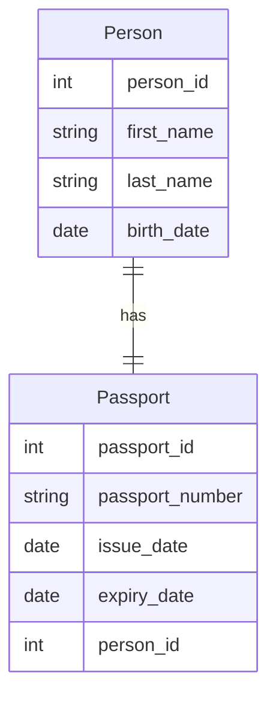
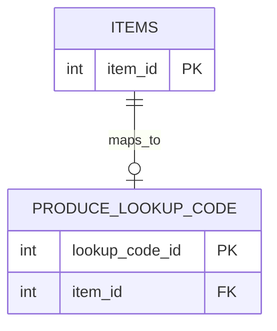

## ERD-101

Entity Relationship Diagrams

### 1:1 Mapping

```mermaid
erDiagram
    Person {
        int person_id
        string first_name
        string last_name
        date birth_date
    }
    Passport {
        int passport_id
        string passport_number
        date issue_date
        date expiry_date
        int person_id
    }
    Person ||--|| Passport : "has"
```

This diagram represents that each **Person** has one **Passport** and each **Passport** is assigned to one Person.

* * *

### Maps To

```mermaid
erDiagram
    ITEMS ||--o| PRODUCE_LOOKUP_CODE : maps_to
    ITEMS {
        int item_id PK
    }
    PRODUCE_LOOKUP_CODE {
        int lookup_code_id PK
        int item_id FK
    }
```