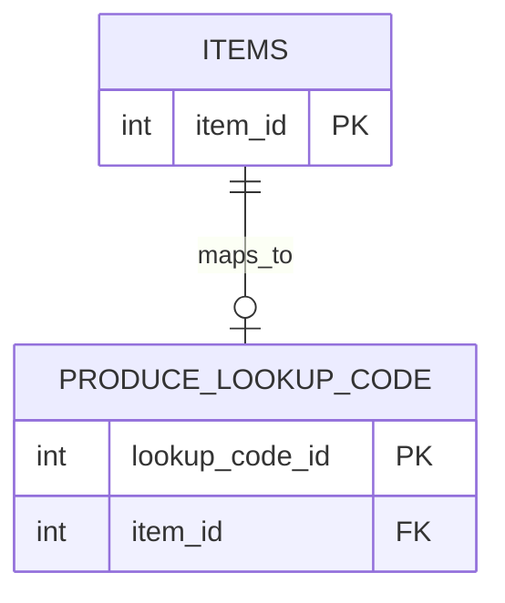

## ERD-101

```mermaid
erDiagram
    ITEMS ||--o| PRODUCE_LOOKUP_CODE : maps_to
    ITEMS {
        int item_id PK
    }
    PRODUCE_LOOKUP_CODE {
        int lookup_code_id PK
        int item_id FK
    }
```